# WeRead
This is an Android project. WeRead is a Android client of content collection , base on Material Design + MVP + RxJava + Retrofit.You can read something interesting about news,picture,video here. 

# APK
[app-release.apk](https://raw.githubusercontent.com/salecoding/WeRead/master/app/app-release.apk)

## SnapShot
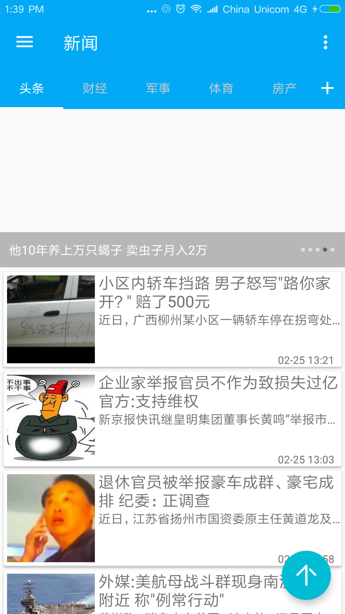
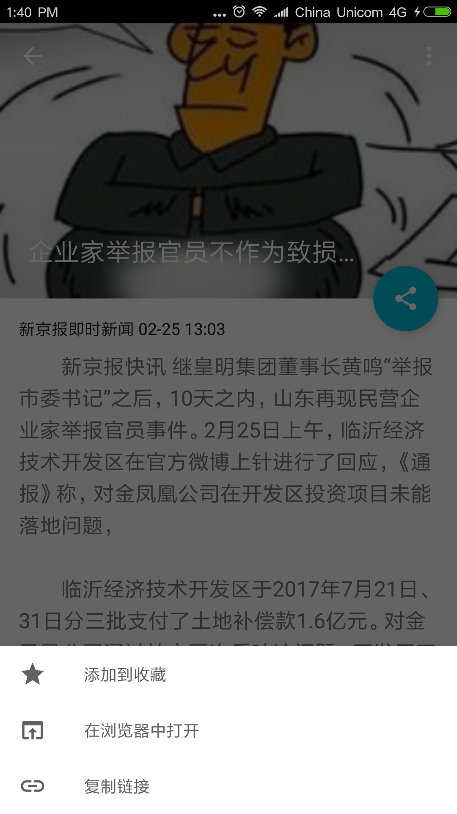
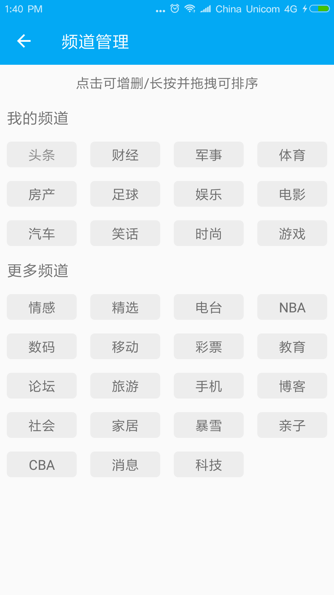
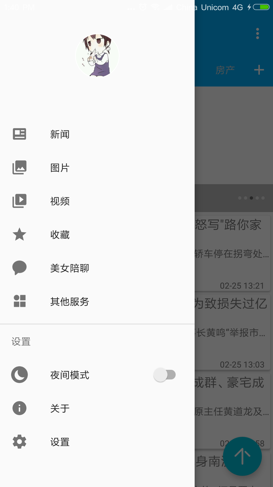
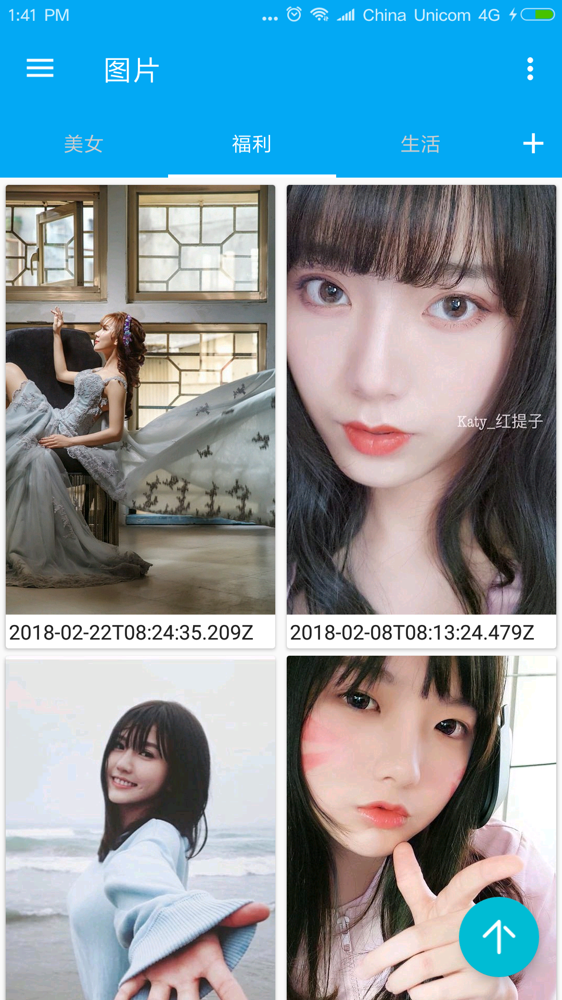
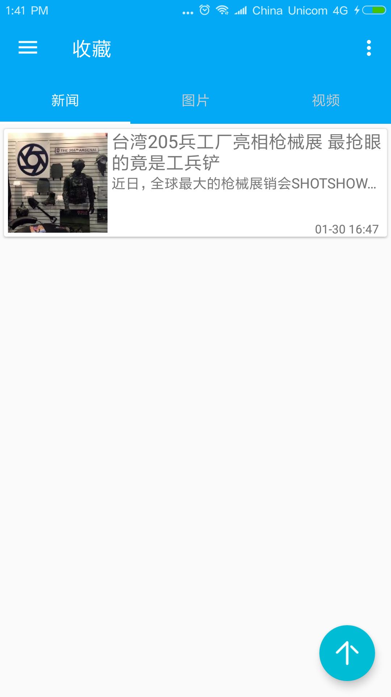
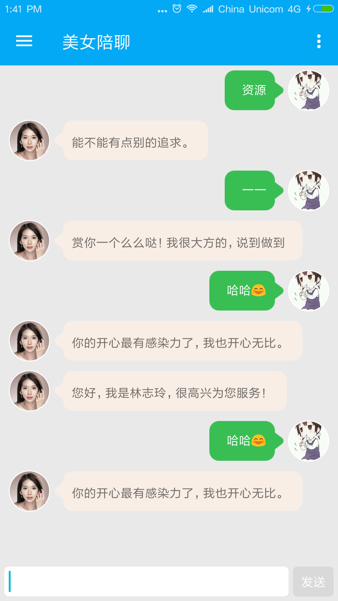
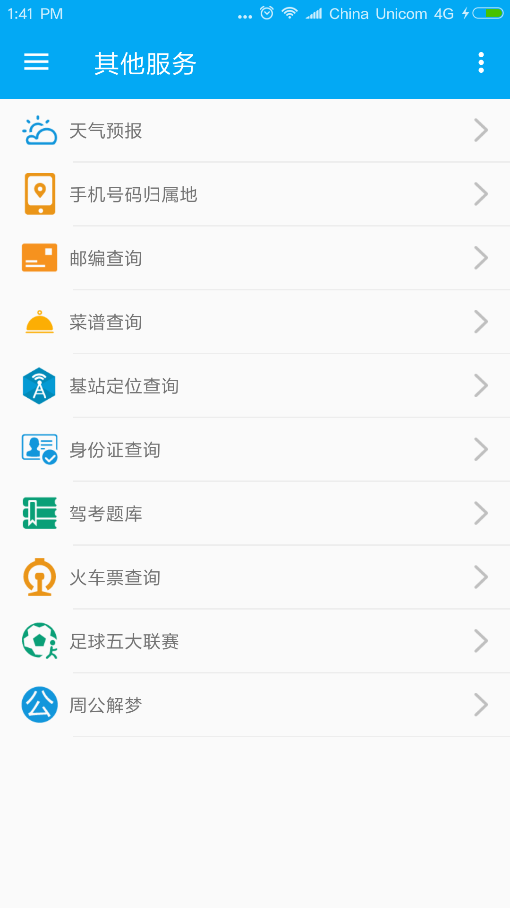
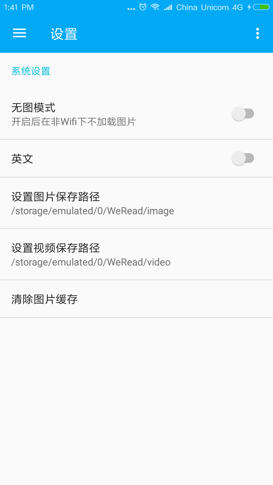
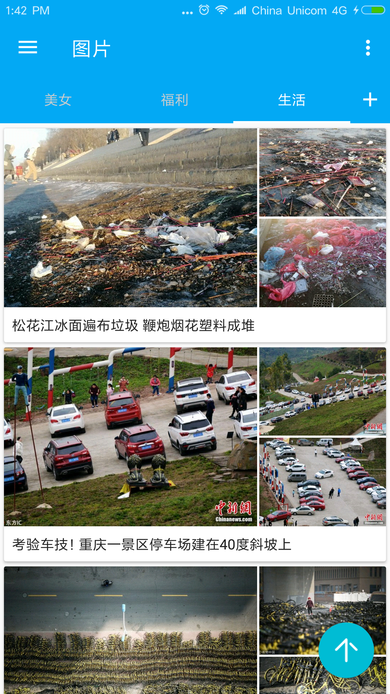
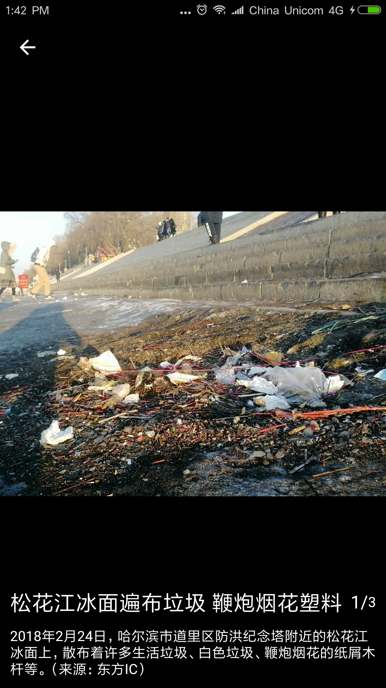

## TODO

- add the channel of video
- something interesting

## Acknowledgements

Thanks to these projects and libraries:

**Libraries**

- [RxJava](https://github.com/ReactiveX/RxJava)
- [RxAndroid](https://github.com/ReactiveX/RxAndroid)
- [Retrofit](https://github.com/square/retrofit)
- [Butter Knife](https://github.com/JakeWharton/butterknife)
- [okhttp3](https://github.com/square/okhttp)
- [greenDAO](https://github.com/greenrobot/greenDAO)

**Design**

- [Material icons](https://design.google.com/icons/)

[Coding](https://coding.net/u/salecoding/p/WeRead/git)
